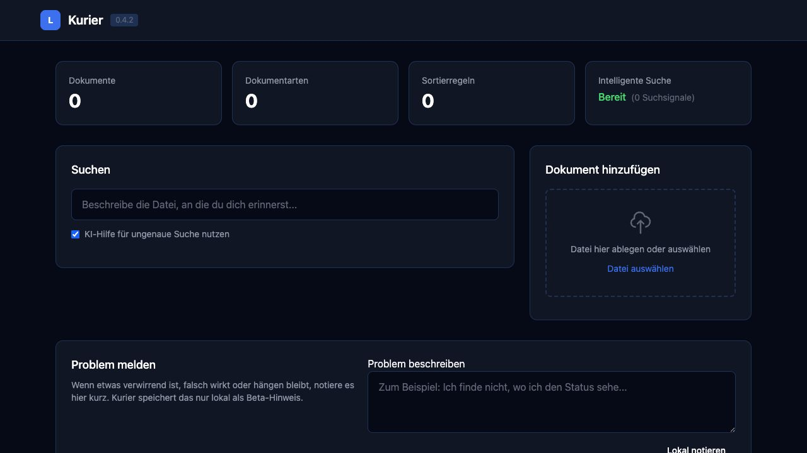
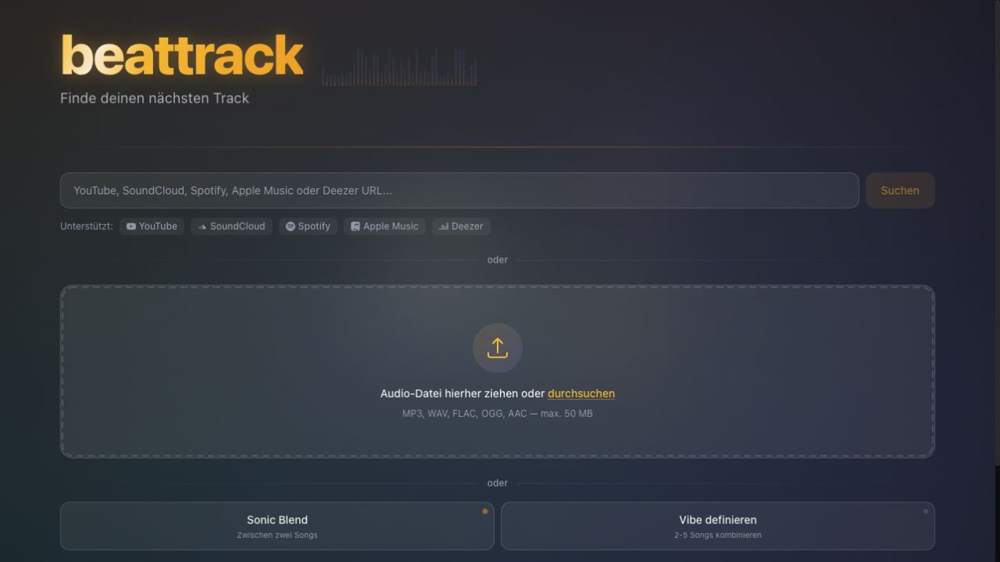

# Hi, I'm Basti 👋

I build practical tools with AI and learn by making things I want to use myself.

My interests come together around **macOS, audio and making information easier to work with**. I care about clear interfaces, understandable workflows and checking whether something actually works in everyday use.

## Currently building: OpenDictate

[**OpenDictate**](https://github.com/HerrStolzier/OpenDictate) is a small macOS dictation app: press a shortcut, speak and get text into the app you're using.

It uses your own OpenAI API key for transcription, keeps the key in macOS Keychain and provides a clipboard fallback when direct insertion isn't available.

**Status:** under active development. Build instructions are available in the repository; a notarized public app download is not yet available.

## More projects

### [Kurier](https://github.com/HerrStolzier/kurier)

A local-first document tool for capturing, classifying and finding information, with optional cloud AI providers.

**Status:** development version with a local dashboard and CLI. The latest published handover identifies review-folder integration as unfinished; this is not a finished consumer release. [Setup](https://github.com/HerrStolzier/kurier#schnellstart) · [Known limitations](https://github.com/HerrStolzier/kurier/blob/main/HANDOVER.md)

See the dashboard

Actual dashboard captured on September 15, 2026, from the published source with a separate empty database. No personal documents or AI processing results are shown.

### [Beattrack](https://github.com/HerrStolzier/beattrack)

Exploring music discovery through audio analysis and song similarity.

**Status:** a public web interface is available. Recommendation quality and provider availability remain development concerns; this screenshot shows the interface, not an end-to-end search test. [Open the web app](https://beattrack.app) · [Source and setup](https://github.com/HerrStolzier/beattrack)

See the web interface

Actual public start page captured on September 15, 2026. No uploads or searches were performed for this screenshot.

Find me on [X (@herrstolzier)](https://x.com/herrstolzier).

## How I build

AI is a substantial part of my development process. I use it to explore ideas, understand code, build features and investigate problems.

I aim for small, understandable changes and practical verification. Automated checks help, and trying the actual user workflow matters too.

Along the way, I'm learning more about Swift and SwiftUI, Python, TypeScript and the tools behind useful software.
